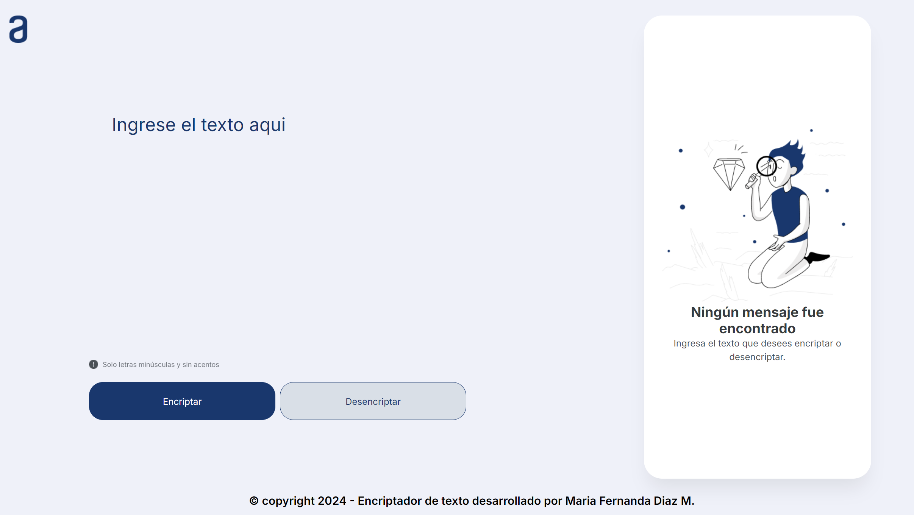

# Encriptador de Texto

## Descripción

El **Encriptador de Texto** es una aplicación web sencilla que permite encriptar y desencriptar mensajes de texto utilizando un algoritmo de sustitución de caracteres.

## Funcionalidades

- **Encriptar Texto**: Convierte tu mensaje en un texto encriptado utilizando una serie de reglas de sustitución.
- **Desencriptar Texto**: Recupera el mensaje original a partir del texto encriptado.
- **Copiar Texto**: Permite copiar el texto encriptado o desencriptado al portapapeles con un solo clic.
- **Alertas**: El sistema muestra mensajes de éxito o error según la operación realizada.

## Uso

1. Ingresa el texto que deseas encriptar en el área de texto proporcionada.
2. Haz clic en el botón **Encriptar** para transformar el texto.
3. Si deseas recuperar el texto original, pega el texto encriptado en el mismo campo y presiona **Desencriptar**.
4. Utiliza el botón **Copiar** para guardar el resultado en tu portapapeles.

## Requisitos

- Navegador web moderno.
- Conexión a Internet (para cargar fuentes y estilos desde CDNs).

## Tecnologías Utilizadas

- **HTML5**: Estructura de la aplicación.
- **CSS3**: Estilos y diseño responsivo.
- **JavaScript**: Lógica de encriptación, desencriptación y manejo del DOM.

## Instalación y Ejecución

1. Clona este repositorio:
    ```bash
    git clone https://github.com/Fernanda121/Encriptador_De_Texto.git
    ```
2. Navega al directorio del proyecto:
    ```bash
    cd encriptador-texto
    ```
3. Abre el archivo `index.html` en tu navegador web preferido.

## Estructura del Proyecto

- `index.html`: Archivo principal de la aplicación.
- `style/style.css`: Estilos de la aplicación.
- `js/app.js`: Lógica de la aplicación.
- `img/`: Contiene imágenes utilizadas en la interfaz.

## Créditos

- Desarrollado por **María Fernanda Díaz M.**
- Diseño y concepto original por [Alura](https://www.alura.com.br/).

¡Gracias por utilizar el Encriptador de Texto! Si tienes alguna sugerencia o encuentras un error, no dudes en abrir un issue o hacer un fork del proyecto.
